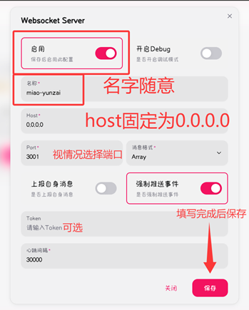

# NapCat 适配器 NapCat-Adapter
#### 简介:
兼容Miao-Yunzai的NapCat适配器，旨在最大程度的兼容所有插件<br>
[加入群聊](https://qm.qq.com/q/DP6Y6UxIqc) ~
#### 警告
  - **重要！** 请勿将`napcat-adapter（即本项目）`和`NapCat.OneBot`项目发布到“bilibili、抖音、快手”等媒体平台
  - 该适配器目前处于Beta开发阶段，依旧有许多未适配。

#### 反馈
  - 遇到任何“ICQQ”可用，但本适配器会报错的问题，请[创建issue](https://gitee.com/qiannqq/napcat-adapter/issues/new/choose)，提交**报错信息、报错插件、报错使用的指令**，等待开发者回复
  - 开发者非常需要这些反馈以尽最大努力完善适配器！拜托请提供正确的反馈信息！

#### 安装方式
```bash
git clone --depth=1 https://gitee.com/qiannqq/napcat-adapter.git ./plugins/napcat-adapter
```
安装依赖
```bash
pnpm install --filter=napcat-adapter
```

#### 连接方式
  - ⚠️本适配器为正向WS连接，请确保`napcat-adapter`可以正常访问NapCat.OneBot所提供的端口
  1. 安装并打开NapCat.OneBot，登录"http://你的IP地址:6099/webui"，秘钥默认为`napcat`
  2. 在网络配置里创建一个 **WebSocket服务器** ，并启用<br>

  3. 打开`./config/bot.yaml`中，将“跳过登录icqq”启用
  4. 安装本适配器后启动一次，打开`./plugins/napcat-adapter/config/config/cfg.yaml`
  5. 编辑baseUrl地址为napcat-ws-server地址
  6. 重启后即可享用

#### 支持
| 功能 | 支持情况 |
|---|---|
| 收发消息 | ✅ |
| 戳一戳 | ✅ |
| 合并转发、嵌套转发 | ✅ |
| 图片、图文混排、语音、视频 | ✅ |
| 文件相关 | 部分支持，正在完善... |
| 椰奶发表说说、公告等api操作 | ✅ |
| 发音乐卡片、赞我等 | ✅ |
| 事件接受 | 部分支持，未来完善 |


#### 致谢
  - NapCat 会魔法的猫娘（？）
  - node-napcat-ts 本适配器的依赖
  - Lain-plugin 铃音插件，CV了部分消息处理源码（不然进度不会这么快）

#### 赞助
  - [爱发电](https://afdian.com/a/qiannqq)