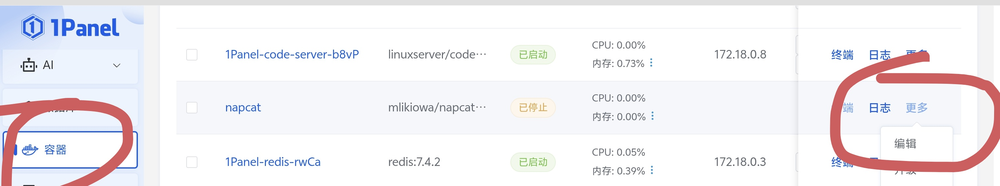
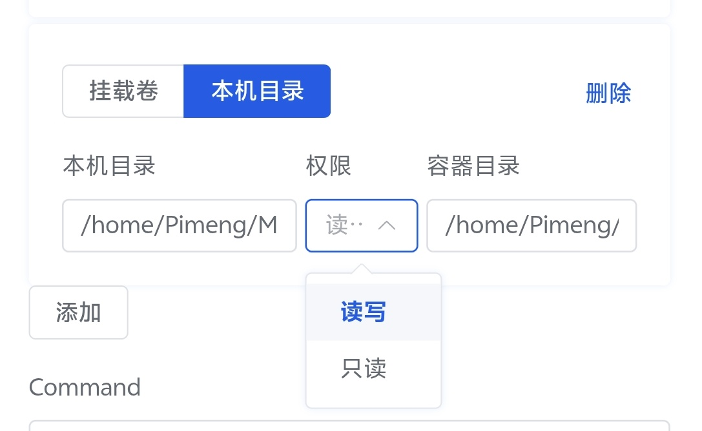
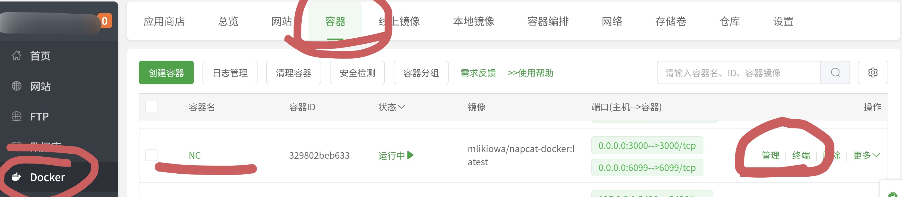
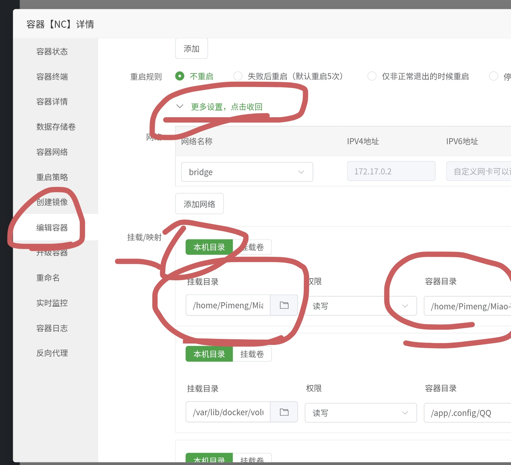
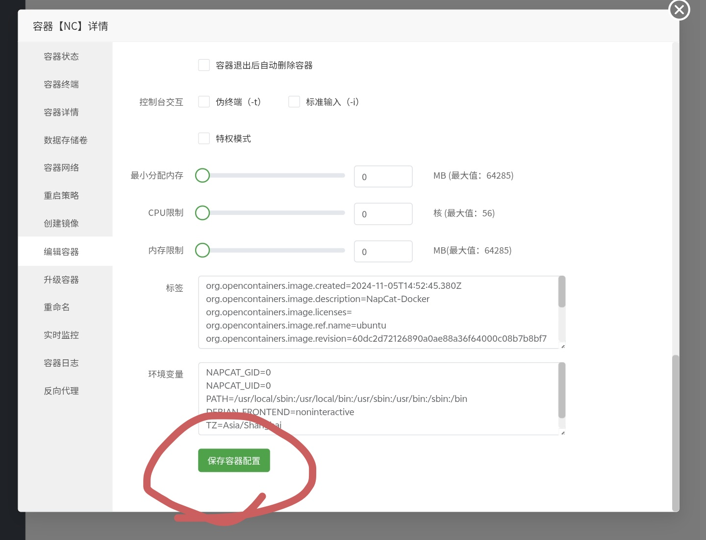

# Yunzai NapCat 适配器 NapCat-Adapter

<p align="center">
  
</p>

#### 简介

兼容 Miao-Yunzai 的 NapCat 适配器，旨在最大程度地兼容所有插件
[加入官方群聊](https://qm.qq.com/q/DP6Y6UxIqc) \~

#### 警告

* **重要！** 请勿将 `napcat-adapter（即本项目）` 和 `NapCat.OneBot` 项目发布到“bilibili、抖音、快手”等国内平台（评论留言也不行！）

#### 注意事项

* 本适配器虽然已趋于稳定，但并不保证完美兼容。我会持续优化该适配器，目的是做到接近 icqq 的使用感受，接近 icqq 的兼容性。
* 目前群内多人发现使用 Windows NapCat 容易被踢下线，请谨慎使用 Windows NapCat，建议使用 WSL 替代。

#### 兼容的 Yunzai 版本

| Yunzai 版本           | 兼容情况 |
| ------------------- | ---- |
| Miao-Yunzai         | ✅    |
| TRSS-Yunzai         | ✅    |
| Yunzai-Next         | ✅    |
| Yunzai-Bot          | ✅    |
| 理论上支持 V3 插件的 Yunzai | ✅\*  |

#### 反馈

* 遇到任何 “ICQQ 可用，但本适配器会报错” 的问题，请 [创建 issue](https://gitee.com/qiannqq/napcat-adapter/issues/new/choose)，选择 `Bug 报告`，然后提交即可，开发者有空就会回复。
* 开发者非常需要这些反馈以尽最大努力完善适配器！请提供正确的反馈信息。

#### 安装方式

**Gitee 源（国内网络环境推荐）**

```bash
git clone --depth=1 https://gitee.com/qiannqq/napcat-adapter.git ./plugins/napcat-adapter
```

**GitHub 源**

```bash
git clone --depth=1 https://github.com/qiannqq/napcat-adapter.git ./plugins/napcat-adapter
```

**安装依赖**

```bash
pnpm install --filter=napcat-adapter
# Yunzai-Next 请使用以下指令安装依赖
# yarn install
```

#### 连接方式

* ⚠️ 本适配器的工作模式为 **正向 WS 连接**，请确保 `napcat-adapter` 可以正常访问 NapCat.OneBot 所提供的 IP 和端口。
* ⚠️ 如果 Miao-Yunzai 与 NapCat.OneBot 不在同一环境（例如一方在 Docker、WSL 系统），你可能需要额外配置，或查询 IP 地址并正确配置以确保连接正常。

关于 WSL 的帮助请参考：[WSL Networking Documentation](https://learn.microsoft.com/zh-cn/windows/wsl/networking#identify-ip-address)
关于 Docker 配置端口映射请参考：[Docker 镜像配置端口](https://www.doubao.com/thread/w76de7e1b8088ac44)

1. 安装并打开 NapCat.OneBot，登录 `http://你的IP地址:6099/webui`，默认登录密码为 `napcat`。
2. 扫码登录账号后，在网络配置里创建一个 **WebSocket 服务器**，并启用。
   
3. 打开 Miao-Yunzai 根目录下的 `config/config/bot.yaml`，将 `skip_login: false` 改为 `skip_login: true`（大约在第 32 行），以解决多个适配器互相影响导致报错的问题。
4. 安装本适配器后启动一次，打开插件根目录下的 `config/config/cfg.yaml`，编辑 `baseUrl` 地址为刚刚在 NapCat WebUI 中配置的地址（例如：`ws://0.0.0.0:3000`）。如果在配置 WebSocket 服务器时输入了 token，请取消配置文件里 token 的注释，并编辑为你在 WebSocket 服务器配置的 token。
5. 重启 Yunzai 后即可享用。

#### 关于文件

* WebSocket 支持小文件（图片、视频、音频、文件等任何形式的数据）传输，但单帧最大为 16MB，因此文件传输大小被限制为 10MB。超过 10MB 的文件将直接让 NapCat 读取本地文件。
* 如果有大文件传输需求，请确保 NapCat.OneBot 可以访问 Miao-Yunzai 的目录，因使用绝对路径，需让 NapCat.OneBot 访问的路径与真实路径一致。

1. **Docker**

   <details>
     <summary>1Panel</summary>

   登录面板后，点击左侧“容器”，找到当前使用的 NapCat 容器，点击“编辑”。
   
   找到目录挂载，添加一个，左侧选择本机目录（喵崽所在绝对路径），右侧容器目录填写相同路径。
   

   </details>

   <details>
     <summary>宝塔面板</summary>

   登录面板后，点击左侧“Docker”，再点击“容器”，找到当前使用的 NapCat 容器，点击“管理”。
   
   在“更多设置”中添加“挂载/映射”，选择本机目录（喵崽所在绝对路径），右侧容器目录填写相同路径。
   
   保存容器配置即可。
   

   </details>

   <details>
     <summary>其他还在烧烤中</summary>

   都说了还在烧烤中看不到吗？
   

   </details>

2. **Windows**

   * 一般来说，Windows 下的 Miao-Yunzai 和 NapCat.OneBot 目录一致，无需额外配置。

3. **Android Termux**

   <details>
     <summary>tmoe Chroot 容器</summary>

   此方法重启后失效，需每次重启后重新配置。
   Chroot 仅限 Root 环境。

   ```bash
   # 在 Termux 中执行，而非容器环境
   su
   cd /data/data/com.termux/files/home/.local/share/tmoe-linux/containers/chroot/<NapCat容器名称>/root
   mkdir TRSS_AllBot
   mount --bind /data/data/com.termux/files/home/.local/share/tmoe-linux/containers/chroot/<Yunzai容器名称>/root/TRSS_AllBot /data/data/com.termux/files/home/.local/share/tmoe-linux/containers/chroot/<NapCat容器名称>/root/TRSS_AllBot
   exit
   ```

   </details>

4. **跨设备（完全不在同一设备）、WSL**

   <details>
     <summary>点击展开</summary>

    1. 方案1，Yunzai、Lain-drive各自独立运行
   ```bash
   # 部署到 NapCat 和 Miao-Yunzai 都能访问的服务器
   git clone https://gitee.com/qiannqq/Lain-drive.git
   # 安装 Lain-drive依赖
   pnpm i
   # 启动指令
   node .
   # 启动后，在 config/config.yaml 修改服务器地址为 NapCat 可访问的地址
   # 在 Yunzai 安装该插件
   curl -o "./plugins/example/大文件上传.js" "https://gitee.com/qiannqq/yunzai-plugin-JS/raw/master/JS/uploadFile.js"
   # 编辑插件中 IP 地址为你部署 Lain-drive 的地址
   # 在 Yunzai 根目录安装依赖
   pnpm i node-fetch -w
   ```
    2. 方案2，将Lain-drive作为插件放进Yunzai中，跟随插件加载一起启动<br>
      [点此跳转方案2](https://gitee.com/qiannqq/Lain-drive#lain-drive-%E6%96%87%E4%BB%B6%E6%9C%8D%E5%8A%A1%E5%99%A8-napcat%E8%B7%A8%E8%AE%BE%E5%A4%87%E4%BC%A0%E8%BE%93%E6%96%87%E4%BB%B6%E8%A7%A3%E5%86%B3%E6%96%B9%E6%A1%88)

   </details>

#### 支持

| 功能                | 支持情况 |
| ----------------- | ---- |
| 收发消息              | ✅    |
| 戳一戳               | ✅    |
| 合并转发、嵌套转发         | ✅    |
| 图片、图文混排、语音、视频     | ✅    |
| 文件相关              | \*✅  |
| 椰奶发表说说、公告等 API 操作 | ✅    |
| 发音乐卡片、赞我等         | ✅    |
| 事件接受              | \*✅  |

#### 常见问题

**问：** 我的插件/Bot 日志出现以下报错，怎么办？

```
[MiaoYz][xx:xx:xx.xxx][ERRO] ApiRejection {
    code: XX,
    message: 'client not online'
}
```

**答：** 若报错信息包含 “`client not online`”，请更新适配器：`#nc更新`

**问：** 如何连接多个 NapCat？
**答：** 在锅巴的插件配置中打开“多Bot”选项，按照提示在对应文件进行配置即可。

**问：** 嵌套转发中第二层消息打不开，显示加载失败？
**答：** QQ 手机版自 9.1.67 (不含) 后，无法看到 NapCat 发送的嵌套消息，PC 版暂未受影响，请尽量避免发送嵌套转发。

#### 致谢

* NapCat 魔法猫娘（？）
* node-napcat-ts 本适配器依赖
* Lain-plugin 铃音插件，借鉴部分消息处理源码

#### 参与贡献

* 部分事件监听尚未编写，欢迎反馈。
* 在 `bot.yaml` 中开启 debug 日志，收到事件后将打印日志和包体。
* 可创建 issue 并附上事件包，或直接提交 PR，开发者会尽快处理。

#### 赞助

* [爱发电](https://afdian.com/a/qiannqq)
